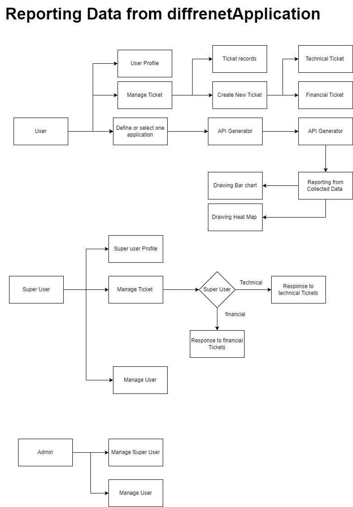

<div align="center">
<h1 align="center">SanaPlus_Project</h1>
<h3 align="center">Sample Project with base usage and deployment</h3>
</div>
<p align="center">
<a href="https://www.python.org" target="_blank">  </a>
<a href="https://www.postgresql.org" target="_blank">  </a>
<a href="https://www.django-rest-framework.org/" target="_blank">  </a>
<a href="https://www.nltk.org/" target="_blank">  </a>


</p>

# SanaPlus 
- Launched : October 2018

Sana company is working in the field of data analytics module and creating web service. Before they launch this project.  I have helped them update and/or develop new projects and this project is only one case which allowed me to share with our customers. I was glad to help this company.

# Why this application is formed :
The SanaPlus project is an innovative solution designed to enhance data analysis capabilities, empowering marketing teams and managers to make informed decisions based on actionable insights. This comprehensive project is structured into three key components to optimize the data management and reporting processes:

## Management Panel:
At the heart of the SanaPlus project lies a user-friendly management panel, providing an intuitive interface for users to navigate and access critical data analytics. This panel enables managers to visualize trends, monitor performance metrics, and effectively interpret data to drive strategic initiatives.

## Data Collection using APIs:
To facilitate robust data analysis, SanaPlus employs advanced API integrations to collect data from various sources. This seamless data retrieval process ensures that stakeholders have access to real-time information, enhancing their ability to analyze market trends, consumer behavior, and operational performance.

## Information Reporting:
The final component of the SanaPlus project focuses on delivering comprehensive information reporting. With customizable reports and visualizations, users can easily digest complex data sets, uncover insights, and communicate findings effectively to inform marketing strategies and operational decisions.

Through its structured approach, the SanaPlus project not only streamlines data analysis but also plays a pivotal role in shaping the decision-making processes within organizations, ultimately fostering a data-driven culture in marketing and management.

# value proposition:
The SanaPlus project presents a compelling value proposition aimed at enhancing application development and decision-making processes for businesses. Here’s a detailed breakdown of each component of the value proposition:

## API Generator for Different Applications
Description: The SanaPlus project offers an API generator that simplifies the process of creating custom APIs for various applications.

### Details:
Ease of Use: The API generator is designed to be user-friendly, enabling developers with varying levels of expertise to create robust APIs quickly and efficiently without extensive coding knowledge.
Flexibility: This feature supports multiple programming languages and frameworks, allowing businesses to integrate the API seamlessly into their existing environments.
Scalability: As businesses grow, the API can be easily scaled to accommodate increased traffic and more complex functionalities. This ensures that businesses can adapt to changing needs without a complete overhaul of their systems.
Time and Cost Efficiency: By automating the API creation process, companies can save significant time and resources, reducing the time-to-market for new applications and features.
## Analytic Tools for Decision-Making Processes
Description: SanaPlus provides analytic tools tailored for various applications, specifically designed to support marketing and managerial decision-making.

### Details:

Data-Driven Insights: The analytic tools leverage large datasets to provide actionable insights, helping businesses understand customer behavior, market trends, and performance metrics.
Custom Reporting: Users can generate personalized reports that highlight key performance indicators (KPIs) relevant to their specific business needs, allowing for more targeted decision-making.
Predictive Analytics: Incorporating machine learning algorithms, the tools can forecast future trends and behaviors, enabling proactive strategy development instead of reactive management.
Integration with Existing Systems: The tools can easily integrate into current business systems, ensuring that data from various sources can be harmonized for a comprehensive view.
## Collaborative Recommender Systems Based on User Clicks
Description: The SanaPlus project features a collaborative recommender system that analyzes user clicks and behavior to enhance the purchasing experience.

### Details:

Personalized Recommendations: By analyzing users' interaction data (like click patterns), the system provides tailored product recommendations, making it easier for users to discover items that align with their preferences.
Increased Conversion Rates: By suggesting products that are relevant to the user’s interests, businesses are likely to see an increase in conversion rates and overall sales.
User Engagement: The recommender system is designed to engage users, encouraging them to explore and purchase desired goods, ultimately improving customer satisfaction and loyalty.
Collaborative Filtering: The system can utilize collaborative filtering to suggest products based on similar users’ choices, leveraging community behavior to refine recommendations further and enhance discovery.
## Overall
The combination of these three elements positions the SanaPlus project as an innovative solution for businesses looking to harness technology to improve their operational efficiencies and marketing effectiveness. By providing user-friendly tools for API generation, data analytics, and personalized recommendations, SanaPlus aims to empower organizations to make informed decisions, engage customers more effectively, and drive revenue growth. This comprehensive offering can support businesses in various sectors, from e-commerce to SaaS platforms, by enhancing their ability to connect with users and respond to market demands in real-time.


# Reqiurements:
•	HTML/CSS/Bootstrap template

•	Python/ Numpy/ SciPy / Tensorflow/

•	Django

•	Javascript/Jquery/ 

# Structure Database


# Clone the repo
Clone this repo anywhere you want and move into the directory:
```bash
git clone https://github.com/Ahmadzadeh920/SanaPlus.git
```

# License
MIT.


# Bugs
Feel free to let me know if something needs to be fixed. or even any features seems to be needed in this repo.


